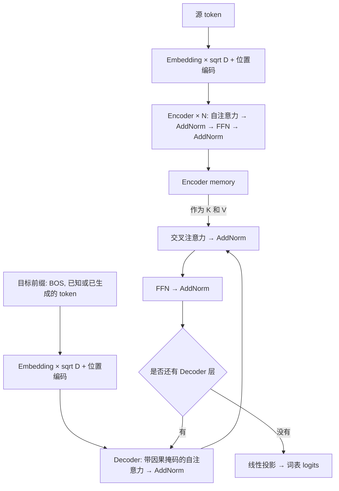

# 手撕 Transformer

使用 PyTorch 的张量运算、自动求导和基础网络组件实现。

注意力计算、多头拆分与合并、LayerNorm、正弦位置编码、Encoder/Decoder 和掩码均在项目内实现。

演示任务是反转数字序列：输入 `1 2 3 4`，模型逐步生成 `4 3 2 1`。数据在本地自动生成，不需要下载数据集。

## 直接运行

当前工作区的默认 `python3` 已安装 PyTorch，可以直接执行：

```bash
# 已附带本次训练得到的模型，可直接预测。
python3 predict.py --numbers 1 2 3 4

# 从头训练，默认将验证表现最好的模型保存到 checkpoints/reverse.pt。
python3 train.py

# 测试核心数学、掩码、梯度、保存加载，以及小批量过拟合。
python3 -m unittest discover -s tests -v
```

推理示例输出：

```text
输入：[1, 2, 3, 4]
预测：[4, 3, 2, 1]
```

在新环境中安装，使用 Python 3.10 或更高版本：

```bash
python3 -m venv .venv
source .venv/bin/activate
python -m pip install -r requirements.txt
python train.py
```

项目唯一直接依赖是 `torch==2.14.0`，其传递依赖由安装工具解析。原有的 `.venv_transformer` 尚未安装 PyTorch；若选择使用那个环境，也需要先安装依赖。

脚本会自动选择可用的 CUDA，否则使用 CPU。可以通过 `--device cpu` 或 `--device cuda` 指定设备。默认 CPU 线程数为 1，适合本例的小矩阵；可用 `--threads` 调整。

## 文件和阅读顺序

| 文件 | 内容 |
| --- | --- |
| [transformer.py](transformer.py) | 掩码、注意力、多头注意力、LayerNorm、位置编码、完整模型、贪心解码 |
| [data.py](data.py) | 词表、合成数据、右侧补齐、Decoder 输入与标签的错位 |
| [train.py](train.py) | 训练循环、验证指标、梯度裁剪、最佳模型保存 |
| [predict.py](predict.py) | 加载 checkpoint，从 BOS 开始逐 token 推理 |
| [tests/test_transformer.py](tests/test_transformer.py) | 数学计算和模型行为测试 |

建议先从 `scaled_dot_product_attention` 看起，再看 `MultiHeadAttention`，最后按 EncoderLayer → DecoderLayer → Transformer → greedy_decode 的顺序阅读。中文注释标出了关键张量形状。

## 模型结构

采用原论文式的 **Post-LN**：每个子层后进行残差连接与 LayerNorm。为方便 CPU 演示，默认使用 2 层 Encoder、2 层 Decoder、64 维隐藏状态、4 个注意力头和 128 维前馈层，总参数量为 **169,933**。



### 1. 注意力到底计算什么

```text
Q = query × Wq + bq
K = key   × Wk + bk
V = value × Wv + bv

scores  = QKᵀ / sqrt(d_k)
weights = softmax(scores + mask)
context = weights × V
```

`QKᵀ` 衡量每个 query 与各个 key 的相关性；softmax 把分数变成权重，再对 value 求加权和。除以 `sqrt(d_k)` 是为了控制点积的尺度，避免维度增大时 softmax 过于尖锐。

这里的 `scores + mask` 是数学表达。代码接受 bool 掩码，通过 `masked_fill` 把禁止位置设为负无穷。softmax 沿最后的 key 维度计算。训练时还会对权重应用 Dropout。

### 2. 多头注意力的张量形状

记 `B` 为 batch 大小，`Lq` 为 query 长度，`Lk` 为 key/value 长度，`D` 为隐藏维度，`H` 为头数，`d_k = D / H`。

| 步骤 | 形状 |
| --- | --- |
| 输入 query | `[B, Lq, D]` |
| 投影并拆分 Q | `[B, H, Lq, d_k]` |
| 投影并拆分 K/V | `[B, H, Lk, d_k]` |
| 注意力分数与权重 | `[B, H, Lq, Lk]` |
| 每个头的上下文 | `[B, H, Lq, d_k]` |
| 交换维度并拼接所有头 | `[B, Lq, D]` |
| 经过输出投影 | `[B, Lq, D]` |

自注意力的 Q/K/V 来自同一个序列；Decoder 交叉注意力的 Q 来自 Decoder，K/V 来自 Encoder 的最终输出，因此 `Lq` 与 `Lk` 可以不同。

### 3. 位置编码、前馈网络与归一化

注意力计算本身没有显式的序号信息，需要把位置加入 token 表示：

```text
PE(pos, 2i)     = sin(pos / 10000^(2i / D))
PE(pos, 2i + 1) = cos(pos / 10000^(2i / D))
输入表示 = Dropout(Embedding(token) × sqrt(D) + PE)
```

位置编码注册为 buffer，随模型保存和迁移设备，不参与训练。

前馈网络对每个位置独立使用同一组参数：`Linear(D, d_ff) → ReLU → Dropout → Linear(d_ff, D)`。它改变特征表示，不在位置之间混合信息。

手写 LayerNorm 对每个 token 的最后一个维度计算总体方差：

```text
mean = mean(x, dim=-1)
var  = mean((x - mean)², dim=-1)
LayerNorm(x) = gamma × (x - mean) / sqrt(var + eps) + beta

AddNorm(x, sublayer) = LayerNorm(x + Dropout(sublayer(x)))
```

### 4. 两种掩码

本项目所有注意力掩码统一采用 **True = 允许关注，False = 禁止关注**。

**Padding mask** 形状为 `[B, 1, 1, Lk]`，隐藏 key/value 中补齐的 PAD 位置，在注意力头与 query 位置上广播。Encoder 自注意力与 Decoder 交叉注意力使用源序列的 padding mask。

**Causal mask** 形状为 `[1, 1, T, T]`，是包含对角线的下三角矩阵：

```text
1 0 0 0
1 1 0 0
1 1 1 0
1 1 1 1
```

Decoder 自注意力使用目标 padding mask 与 causal mask 的逻辑与。对角线保留，是因为当前输入 token 用于预测下一个 token。

PAD query 位置仍然可以产生输出，但它们不贡献训练 loss，并且不能作为有效 key 被其他位置关注。整行都被屏蔽时，注意力权重显式置零，避免 `softmax([-inf, ...])` 产生 NaN。

### 5. 训练为何要错开一位

词表共 13 个 token：`PAD=0`、`BOS=1`、`EOS=2`，数字 `0～9` 对应 token ID `3～12`。下例使用数字本身表示内容：

```text
源输入：       [1,   2, 3, EOS]
完整目标：     [BOS, 3, 2, 1, EOS]
Decoder 输入： [BOS, 3, 2, 1]
训练标签：     [3,   2, 1, EOS]
```

训练使用真实目标前缀，即 teacher forcing。位置 0 看到 BOS，预测 3；位置 1 看到 BOS 和 3，预测 2。因果掩码保证模型不能偷看后面的正确答案，同时允许所有位置并行计算。

模型返回 `[B, T, vocab_size]` 的原始 logits。交叉熵内部计算 log-softmax，因此送入交叉熵前不用额外做 softmax。标签中的 PAD 被忽略，loss 按有效 token 数平均。

训练使用固定学习率的 Adam 和梯度裁剪。默认 Dropout 为 0.1；较高的训练 loss 与较低的验证 loss 可以同时出现，因为验证时会关闭 Dropout。

### 6. 推理如何一步步生成

推理只给 Encoder 源序列，Decoder 从 BOS 开始：

```text
[BOS]          → 预测 4
[BOS, 4]       → 预测 3
[BOS, 4, 3]    → 预测 2
[BOS, 4, 3, 2] → 预测 1
...            → 预测 EOS，停止
```

Encoder 只计算一次；每一步用当前前缀重新计算 Decoder，取最后一个位置的 logits 做 argmax。本实现采用贪心解码，没有 KV cache。BOS 和 PAD 不作为有效生成候选；一个 batch 内已经生成 EOS 的序列只补 PAD，直到所有序列结束或达到长度上限。

## 调整规模

```bash
# 快速检查完整训练流程；少量训练不保证学会任务。
python3 train.py --epochs 2 --train-size 256 --val-size 64 --checkpoint checkpoints/smoke.pt

# 增加训练长度，保存到另一个文件。
python3 train.py --max-length 12 --epochs 40 --checkpoint checkpoints/reverse12.pt
python3 predict.py --checkpoint checkpoints/reverse12.pt --numbers 1 2 3 4 5 6 7 8 9 0

# 查看其他可调参数。
python3 train.py --help
```

默认数字序列训练长度为 3～8，checkpoint 的最大位置数还包括一个 EOS/BOS 位置。默认推理入口拒绝超过 8 个数字的输入；更长序列需要调整配置并重新训练。模型在训练长度范围以外的准确率没有保证。

checkpoint 保存模型配置、参数、训练配置、轮次和验证指标，使用 `weights_only=True` 加载。它用于推理，不包含恢复优化器训练所需的状态。重复使用同一个保存路径会更新该文件；需要保留不同实验时请指定不同的 `--checkpoint`。

## 本次实测

环境为 Python 3.12.14、PyTorch 2.14.0+cu130，实际使用 CPU、1 个计算线程。CUDA 分支尚未在 GPU 上实测。

运行默认参数：4096 条训练样本、256 条独立生成的验证样本、20 轮训练，约 **27.6 秒**。最佳模型出现在第 19 轮，已保存在 `checkpoints/reverse.pt`：

| 指标 | 结果 |
| --- | --- |
| 验证交叉熵 | 0.0053 |
| 使用真实前缀的 token 准确率，包含 EOS、忽略 PAD | 99.94% |
| 自回归生成的整序列准确率，要求 EOS 和长度均正确 | 99.61%（255/256） |

17 项测试全部通过，包括注意力的手算结果、LayerNorm 输出和梯度对照、未来 token 隔离、padding 隔离、全屏蔽行数值稳定性、整模型反向传播、checkpoint 恢复及 4 条样本的过拟合。小样本过拟合测试要求自回归整序列准确率达到 100%。

这些结果用于验证实现能训练并完成这个合成任务，不代表自然语言任务表现。训练设置固定了随机种子，不同硬件和软件版本的结果仍可能略有差异。生成的 checkpoint 已加入 `.gitignore`，如果只复制源码，需要重新训练。
